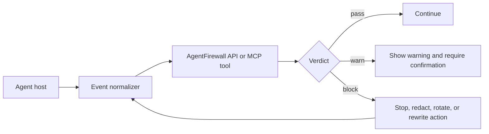

# Architecture

## Product Shape

AgentFirewall should sit beside an AI code agent as a policy sidecar. It should see the same operational stream the agent sees:

- User and assistant messages
- Tool results from browser, GitHub, email, docs, terminals, and MCP servers
- Proposed shell commands before execution
- File reads and writes
- Network destinations and payload summaries
- MCP server or connector configuration changes

The key design choice is to scan the event stream, not only the transcript. A dangerous session can look harmless in chat while the tool layer reads `.env`, pipes downloaded code into a shell, or posts logs to an external endpoint.

## Runtime Flow



## Why API And MCP

REST API is best for service integration:

- SaaS agent hosts
- audit pipelines
- dashboards
- batch scans of long transcripts

MCP is best inside agent workflows:

- self-check before tool execution
- redaction before summarizing context
- local sidecar scanning with stdio
- remote policy server with Streamable HTTP

## Event Normalization

Every host should convert native events into this shared shape:

```json
{
  "kind": "shell",
  "content": "optional tool result text",
  "tool_name": "terminal",
  "command": "python -m pytest",
  "file_path": "optional/path",
  "metadata": {
    "cwd": "repo",
    "source_trust": "external"
  }
}
```

Useful `kind` values:

- `message`
- `shell`
- `tool_result`
- `mcp_result`
- `file_read`
- `file_write`
- `network`
- `browser`
- `email`
- `issue`
- `mcp_config`

## Production Roadmap

1. Deterministic rules and redaction: fast, explainable, safe default.
2. Per-workspace policy: approved domains, allowed secret names, protected paths.
3. Human approval gates: block destructive commands and outbound transfers until reviewed.
4. Signed audit log: store verdicts, redacted evidence, tool event hashes.
5. LLM-assisted review: only for ambiguous cases, never as the only secret detector.
6. MCP reputation layer: score MCP servers by source, scopes, package pinning, and behavior.

## Hard Product Truth

This should not pretend to prove a session is safe. It should answer a narrower and more useful question: "Did the agent conversation or tool stream contain known-dangerous patterns that deserve a stop, warning, redaction, or review?"

That framing keeps the system honest and useful.
